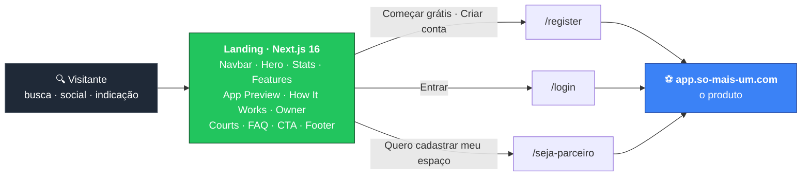

<div align="center">

# ⚽ Só+1 — Landing

### A porta de entrada da plataforma que acaba com o _"falta um?"_ no grupo do WhatsApp.

Landing de conversão do **Só+1**: descubra peladas abertas, entre com um clique e sorteie os times na hora — sem grupo de WhatsApp, sem confusão, só jogo.

<p>
  <a href="https://so-mais-um.com"></a>
  <a href="https://app.so-mais-um.com"></a>
</p>

<p>
  
  
  
  
  
  
  
</p>

<sub>🟢 <strong>Em produção</strong> &nbsp;•&nbsp; 🏟️ <strong>12</strong> modalidades esportivas &nbsp;•&nbsp; 🎬 animações scroll-driven &nbsp;•&nbsp; ⚡ deploy contínuo</sub>

<br/><br/>


<sub><i>A narrativa se revela conforme o scroll — capturado do site em produção.</i></sub>

</div>

---

## 🎯 O que é

Organizar uma pelada hoje é uma sequência de mensagens perdidas: alguém pergunta "fecha 12?", três confirmam, dois somem na hora, o time é dividido no olho e ninguém lembra quem furou semana passada. O **Só+1** resolve isso num app — peladas abertas com vagas visíveis, entrada em um clique, sorteio automático de times e reputação por avaliação. Este repositório é a **landing**: a página que o visitante encontra antes de saber que o app existe.

O papel dela no funil é único e estreito — **transformar visitante em jogador cadastrado**. Ela não guarda dado, não tem formulário e não fala com backend: comunica a proposta em segundos e entrega o clique para `app.so-mais-um.com`. Toda conversão sai daqui por link — cadastro e login para jogadores, portal de parceiros para donos de quadra. São **9 seções** encadeadas numa narrativa `Descobrir → Entrar → Jogar`, cada uma com sua própria animação de entrada.



> A landing é uma **folha do funil**: sem banco, sem API, sem variável de ambiente. HTML pré-renderizado no build e servido pelo CDN da Vercel — o único trabalho dela é não perder o visitante antes do clique.

---

## ✨ Destaques de engenharia

**Uma landing sem uma única imagem.** Não existe `` nem `next/image` no projeto. As linhas de campo do Hero, da seção de modalidades e do CTA são **SVG inline animado por `stroke-dasharray` / `strokeDashoffset`** — o campo se desenha sozinho no viewport. O resto é ícone Lucide (SVG), gradiente CSS e emoji. Zero bitmap para baixar, zero LCP esperando arquivo de imagem, zero `next/image` para configurar.

**Duas estratégias de animação, um breakpoint.** No desktop (`min-width: 768px`) as seções entram com GSAP `ScrollTrigger`. No mobile (`max-width: 767px`) cada componente **desiste do ScrollTrigger** e delega para `useMobileScrollAnimation` — um hook próprio com `IntersectionObserver` que só liga classes CSS com stagger. Scroll-linked animation é caro em tela pequena; keyframes CSS disparados uma vez, não. Cada componente checa `matchMedia` e monta **só um** dos dois caminhos.

**`gsap.context()` e `revert()` em todo componente.** Cada seção embrulha suas tweens em `gsap.context(..., sectionRef)` e devolve `ctx.revert()` no cleanup do effect. Sob o StrictMode do React 19 — que invoca o effect duas vezes em dev — nenhuma tween órfã e nenhum ScrollTrigger duplicado sobrevive. Sem isso, a segunda montagem deixaria triggers vazando e animações disparando em dobro.

**O preview que só liga quando é visto.** A seção de preview do app cicla peladas (3200 ms) e notificações (2400 ms) para simular o produto ao vivo. Os `setInterval` **não começam no mount**: ficam atrás de uma flag `active` que só o `onEnter` do ScrollTrigger levanta. Quem nunca rolou até lá não paga por dois timers rodando numa seção invisível.

**Fonte resolvida no build, não no runtime.** `next/font/google` carrega a Inter com `subsets: ['latin']` e `display: 'swap'`, exposta como a CSS var `--font-inter`. O arquivo é self-hospedado no build — nenhuma request para o Google Fonts no carregamento, nenhum FOIT, e o subset corta o que o português não usa.

**O artefato que o CI testa é o artefato que vai pro ar.** O workflow não empurra o repositório para a Vercel rebuildar do outro lado: ele roda `vercel pull`, `vercel build --prod` e publica com **`vercel deploy --prebuilt`**. O build validado pelo lint no runner é literalmente o bundle servido em produção — sem "passou no CI, quebrou no deploy".

**Composição sem framework de UI.** Cada seção é um componente isolado em `components/landing/`, orquestrado por um `page.tsx` que não faz nada além de empilhar. `Button` e `Badge` são primitivos próprios no padrão shadcn/ui — **CVA** para variantes tipadas e `cn()` (`clsx` + `tailwind-merge`) para resolver conflito de classe, com `focus-visible:ring` no lugar por padrão. Nenhuma dependência de biblioteca de componentes.

---

## 🎬 Seções da landing

<table>
  <thead>
    <tr><th>Seção</th><th>O que comunica</th><th>Animação</th></tr>
  </thead>
  <tbody>
    <tr><td><code>Navbar</code></td><td>Âncoras e os CTAs de <em>Entrar</em> / <em>Começar grátis</em>; fica sólida com blur após 40px de scroll</td><td>GSAP na entrada</td></tr>
    <tr><td><code>Hero</code></td><td>Headline, subheadline e um card de pelada real (vagas 8/12, horário, quadra, Pix)</td><td>Timeline GSAP + campo em SVG que se desenha</td></tr>
    <tr><td><code>Stats</code></td><td>Três provas rápidas: arenas parceiras, modalidades, gratuidade</td><td>Stagger no scroll</td></tr>
    <tr><td><code>Features</code></td><td>6 cards — descoberta, sorteio Fisher-Yates, avaliações, tempo real (SSE), torneios, perfil</td><td><code>autoAlpha</code> + stagger</td></tr>
    <tr><td><code>App Preview</code></td><td>Mock vivo do produto: lista de peladas e notificações que ciclam sozinhas</td><td>Entrada lateral + ciclagem ativada no viewport</td></tr>
    <tr><td><code>How It Works</code></td><td>3 passos: criar conta → achar ou criar pelada → jogar e avaliar</td><td>Linha tracejada em SVG que se desenha ligando os passos</td></tr>
    <tr><td><code>Owner</code></td><td>O outro público: dono de quadra, com mock do painel de parceiro</td><td>Entrada lateral</td></tr>
    <tr><td><code>Courts</code></td><td><strong>12 modalidades</strong> — do futsal ao poker, cada card entrando de uma direção diferente</td><td>Direção por card + campo em SVG</td></tr>
    <tr><td><code>FAQ</code></td><td>6 objeções tratadas antes do cadastro (é grátis? como sorteia? e sem quadra?)</td><td>Accordion + stagger</td></tr>
    <tr><td><code>CTA</code></td><td>O fechamento: criar conta gratuita ou entrar</td><td>Reveal no scroll</td></tr>
    <tr><td><code>Footer</code></td><td>Links de plataforma, portal de parceiros e contato</td><td>—</td></tr>
  </tbody>
</table>

---

## 🛠️ Stack

<table>
  <tbody>
    <tr>
      <td><strong>Runtime</strong></td>
      <td>   — App Router, <code>strict: true</code></td>
    </tr>
    <tr>
      <td><strong>Estilo</strong></td>
      <td>   — tema via <code>@theme</code>, primitivos no padrão shadcn/ui</td>
    </tr>
    <tr>
      <td><strong>Animação</strong></td>
      <td>   — desktop e mobile por caminhos separados</td>
    </tr>
    <tr>
      <td><strong>Assets</strong></td>
      <td>   — nenhuma imagem raster</td>
    </tr>
    <tr>
      <td><strong>SEO</strong></td>
      <td>  — title, description, keywords, OG e <code>lang="pt-BR"</code> no <code>layout.tsx</code></td>
    </tr>
    <tr>
      <td><strong>Qualidade</strong></td>
      <td>  — lint + build a cada push e PR</td>
    </tr>
    <tr>
      <td><strong>Deploy</strong></td>
      <td> — <code>vercel deploy --prebuilt</code> pelo CI; <code>main</code> vai para produção, o resto para preview</td>
    </tr>
  </tbody>
</table>

---

## 🚀 Rodando localmente

### 1. Pré-requisitos

| Requisito | Versão | Por quê |
|---|---|---|
| **Node.js** | **≥ 20.9.0** | exigido pelo `next@16.2.6`. O CI roda **Node 24** — use 20.9+ e prefira 24 se quiser reproduzir o pipeline |
| **npm** | o que vem com o Node | o repo versiona `package-lock.json` |

Não há banco, Docker, serviço externo nem conta em nada. É uma página estática — se o Node sobe, ela sobe.

```bash
node -v   # precisa ser >= v20.9.0
```

### 2. Passo a passo

```bash
# 1. clone o repositório
git clone https://github.com/mateus-vitor-ferreira-dev/so-mais-um-landing.git
cd so-mais-um-landing

# 2. instale as dependências (ci = instalação limpa a partir do lockfile, igual ao pipeline)
npm ci
#    ou, se for mexer nas deps:
npm install

# 3. suba o servidor de desenvolvimento
npm run dev
```

Pronto — **http://localhost:3000**. Não há passo 4: sem migration, sem seed, sem `.env` para preencher.

### 3. Variáveis de ambiente

**Não existe nenhuma.** Isso não é um resumo — é o estado real do repositório:

- não há `.env`, `.env.example` nem `.env.local` no projeto (`.env*` está no `.gitignore` por herança do template do Next);
- `grep -rn "process.env\|NEXT_PUBLIC_" src/` não retorna **nada**;
- o `next.config.ts` está vazio, sem `env` nem `publicRuntimeConfig`;
- os únicos "endereços configuráveis" — `app.so-mais-um.com/login`, `/register`, `/seja-parceiro` — são links literais nos componentes.

A landing não autentica, não consulta API e não persiste nada, então não há segredo para vazar. Os únicos secrets do projeto vivem no GitHub Actions (`VERCEL_TOKEN`, `VERCEL_ORG_ID`, `VERCEL_PROJECT_ID`) e servem **só ao deploy** — nada disso é necessário para rodar local.

> Se um dia a landing ganhar formulário ou analytics, é aqui que a lista aparece. Até lá, qualquer `.env` que você criar é ignorado pelo código.

### 4. Endereços locais

| O que | URL | Sobe com |
|---|---|---|
| Landing (dev, com hot-reload) | `http://localhost:3000` | `npm run dev` |
| Landing (build de produção) | `http://localhost:3000` | `npm run build && npm start` |

A porta 3000 é o default do Next. Para trocar: `npm run dev -- -p 3001`.

### 5. Como verificar que subiu

Abra `http://localhost:3000` e confira, nesta ordem:

1. **O Hero anima sozinho** no load — as linhas do campo se desenham e o card "Society da Quinta" sobe. Se aparecer estático, o GSAP não montou: olhe o console.
2. **Role a página.** Cada seção entra com sua animação. Seção que fica em branco até você rolar até ela é **comportamento esperado** — os triggers são `once: true`.
3. **A navbar muda** de transparente para escura com blur depois de ~40px de scroll.
4. **A seção "Plataforma"** começa a ciclar peladas e notificações assim que entra no viewport (e só então).

Pelo terminal:

```bash
curl -s -o /dev/null -w "%{http_code}\n" http://localhost:3000   # 200
curl -s http://localhost:3000 | grep -o "<title>.*</title>"      # título da landing no HTML pré-renderizado
```

O `grep` no `curl` é o teste que importa: se o `<title>` e o texto do Hero vêm no HTML **sem JavaScript**, o prerender está funcionando.

### 6. Problemas comuns

| Sintoma | Causa | Solução |
|---|---|---|
| `npm run dev` falha logo no start com erro de sintaxe/engine | Node abaixo de 20.9 | `node -v` e atualize — o `next@16` não roda em Node antigo |
| Porta 3000 ocupada | outro app do produto (ex.: o web) já está nela | `npm run dev -- -p 3001` |
| Redimensionei a janela de mobile para desktop e as animações sumiram / não voltam | o `matchMedia` é lido **uma vez no mount**; não há listener de resize | recarregue a página no tamanho que quer testar — é o trade-off da estratégia de dois caminhos |
| Seções abaixo da dobra parecem vazias | os reveals são `once: true` e disparam no scroll | role até elas; não é bug |
| `npm ci` reclama de lockfile fora de sincronia | `package.json` alterado sem regerar o lock | rode `npm install` e commite o `package-lock.json` |

### 7. Scripts disponíveis

| Script | O que faz |
|---|---|
| `npm run dev` | servidor de desenvolvimento com hot-reload em `http://localhost:3000` |
| `npm run build` | build de produção — é o que o CI roda antes de deixar passar |
| `npm start` | serve o build de produção localmente (exige `build` antes) |
| `npm run lint` | ESLint 9 com `eslint-config-next` |

Esses quatro são **todos** os scripts do `package.json`. Não há suíte de testes neste repositório — o portão de qualidade é `lint` + `build` no CI.

---

## 🌿 Fluxo & deploy

`main` (produção · [so-mais-um.com](https://so-mais-um.com)) ← `develop` ← `feature/*` · `fix/*`

O workflow `ci-cd.yml` roda em push e PR para `main` e `develop`: **Lint & Build** primeiro; só depois, e só em push, o job de deploy faz `vercel pull` → `vercel build` → `vercel deploy --prebuilt`. Push em `main` publica em produção; qualquer outro push vira preview. Commits em Conventional Commits (pt-BR).

---

<div align="center">
<sub>Parte do produto <strong>Só+1</strong> · <a href="https://app.so-mais-um.com">app</a> · <a href="https://github.com/mateus-vitor-ferreira-dev/so-mais-um-web">repo do web app</a></sub>
</div>
